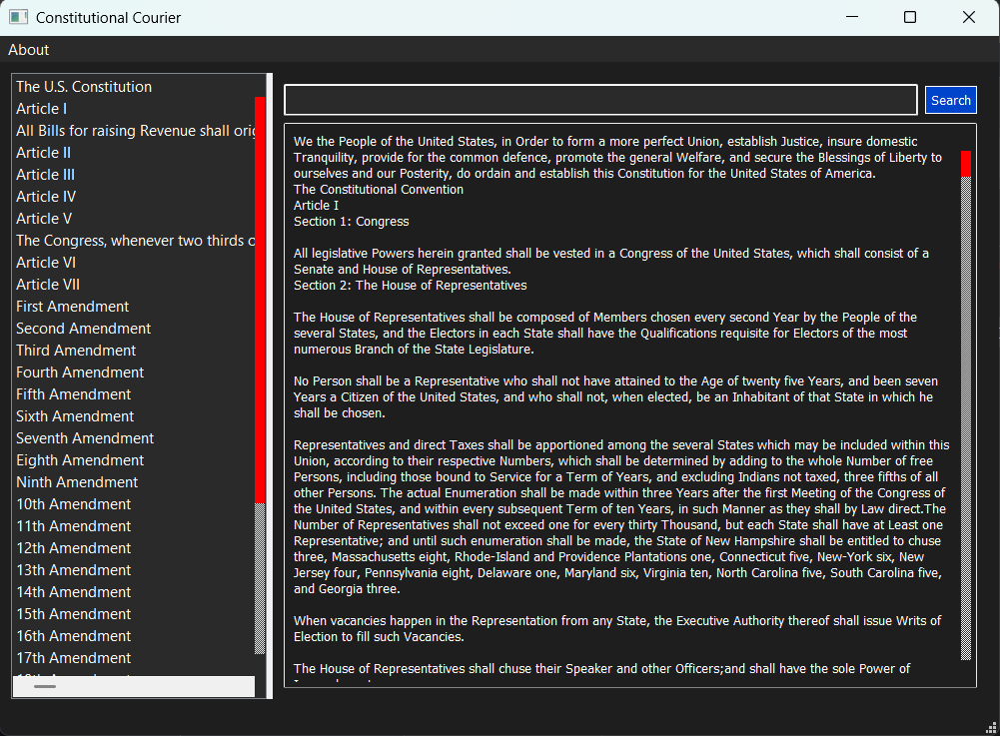

# Constitutional Courier

**Constitutional Courier** is a modern desktop application designed to provide an elegant and intuitive way to explore the United States Constitution. Built with Python and PyQt5, it offers a user-friendly interface that allows users to read, search, and navigate through constitutional texts seamlessly. All offline and simple. This is a derivitive of my GTK app which is much prettier https://github.com/moontowncitizen/constitutional_courier

  


## Features

- **Modern Dark Theme**: 
  - Gruvbox-inspired color scheme.
  - High contrast for improved readability.

- **Interactive Navigation**:
  - Sidebar navigation for quick access to specific sections.
  - Full document view option.
  - Smooth scrolling through articles and amendments.

- **Advanced Search Capabilities**:
  - Real-time full-text search.
  - Highlighted search results.
  - Quick search access via the search bar.

- **User-Friendly Interface**:
  - Split-pane layout with adjustable sidebar.
  - Clean and minimalist design.
  - Keyboard shortcuts for common actions.

## Prerequisites

To run this application, you need to have the following installed:

- Python 3.x
- PyQt5

## Installation

1. **Clone the repository:**
```bash
git clone https://github.com/moontowncitizen/constitutional-courier.git
cd constitutional-courier
```

3. Run the application:
```bash
python3 constitutional_courier.py
```

## Usage

1. **Navigation**
   - Use the sidebar to jump to specific articles or amendments
   - Click "The U.S. Constitution" to view the full document

2. **Searching**
   - Press Ctrl+F to focus the search bar
   - Type your search term and press Enter or click the Search button
   - Search results will be highlighted in the text
   - The status bar will show the number of matches

## Contributing

Contributions are welcome! Here's how you can help:

1. Fork the repository
2. Create a new branch (`git checkout -b feature/improvement`)
3. Make your changes
4. Commit your changes (`git commit -am 'Add new feature'`)
5. Push to the branch (`git push origin feature/improvement`)
6. Create a Pull Request

## To-Do List

1. Bug Fixes
2. Fonts probably Go Mono nerd fonts.
3. Packaging
4. Ports (MacOS and Windows and maybe just maybe an android port)
5. Sound Effects? (revolutionary war sounds ding of liberty bell, tin whistle, yankee doodle etc.){an option only}
6. Maybe a fork of this for each state's constitution all offline.

## License

This project is licensed under the GPL v3.0 License - see the [LICENSE](LICENSE) file for details.

## Acknowledgments

- Built using GTK 4.0 and libadwaita
- Inspired by the need for accessible constitutional texts
- Thanks to the GTK team for their excellent documentation
- Thanks to python3 for being amazing for beginners

## Contact

For questions, suggestions, or issues, please open an issue in the GitHub repository.

## Donate
- My Kofi: https://ko-fi.com/moontowncitizen
- BTC: bc1q4zjudz8f898rc097kq8v6yexcfuwkw0ly488je
- ETH: 0x73d891CbE263932AF1E10231F03eeEab5C07612d
---

Made with ❤️ for constitutional education and open source software!
